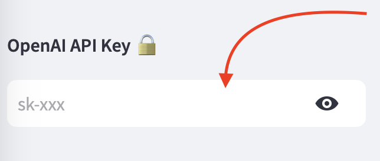

# PDF AI, Streamlit app

## Overview

This PDF AI makes any kinds of requests/prompts against a given PDF file using OpenAI and Langchain. It also uses the [DiceBear Avatar icons](https://www.dicebear.com/styles).

## Requirements

* **Python with Pip**
  * For doing so, install [Python3](https://www.python.org/downloads/)

## Setup the project

From a command line opened in the project folder, run the following:

1. Set an virtual environment (e.g. `python3 -m venv venvAIStreamlit`)
2. Then, activate the virtual environment `source venvGPT/bin/activate`
3. Finally, install the dependencies with Pip3 `pip3 install -r requirements.txt`
4. Run `app_pdf.py` through Streamlit by typing `streamlit run app_pdf.py`
5. Enter your [OpenAI API key](https://platform.openai.com/account/api-keys) in the left sidebar field.

## The author

Hi 👋 I'm **[Pierre-Henry Soria](https://ph7.me)**. A super passionate and mission-driven software engineer! 🤠
I'm also a true cheese 🧀, dark chocolate, and espresso lover! 💫
